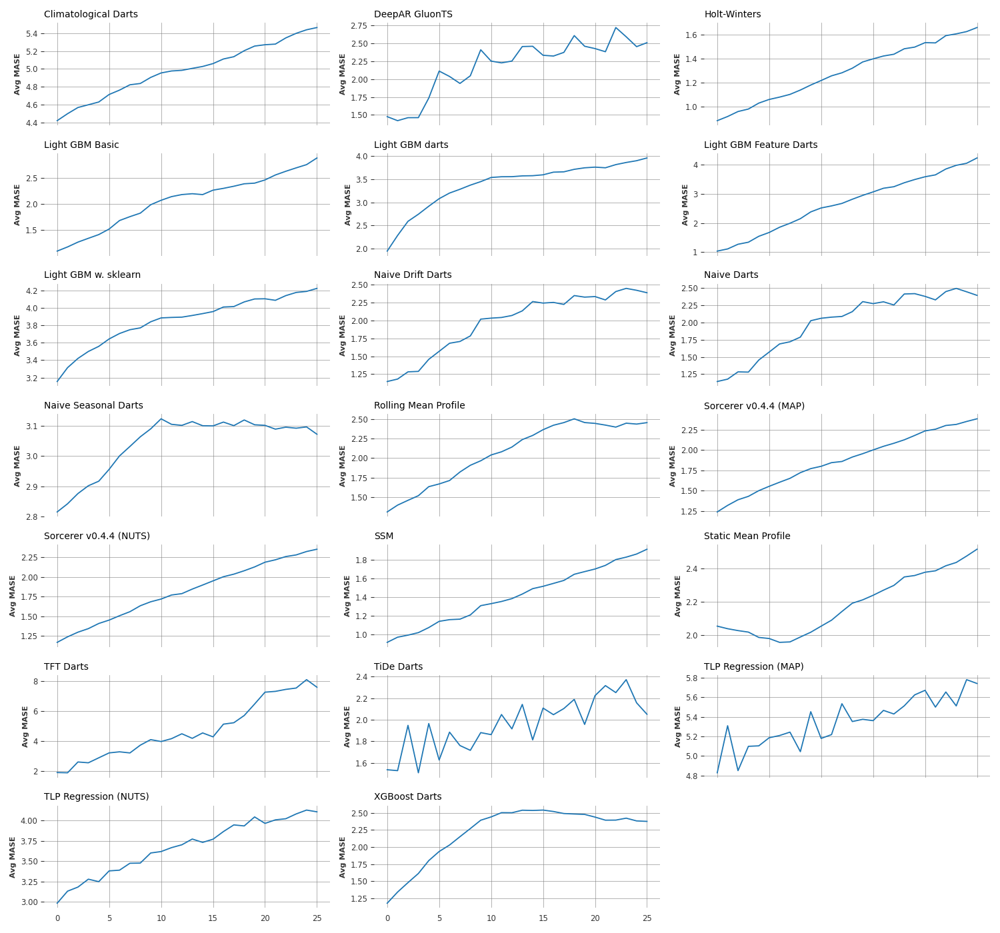

# Python Time Series Forecasting Review

**Jonas Petersen**: [LinkedIn](https://www.linkedin.com/in/jonas-petersen-58b916128/) 
**Anders Runge Walther**:  [LinkedIn](https://www.linkedin.com/in/anders-runge-walther-5aa169138/) 
**Simon Søndergaard Holm**: [LinkedIn](https://www.linkedin.com/in/simon-s%C3%B8ndergaard-holm/) 

## Introduction

This study represents a collaborative effort to review a diverse set of Python-based time series forecasting modules. The code and project are publicly available on [GitHub](https://github.com/KaptajnFjaesing/TimeSeriesForecastingReview).

The forecast modules are reviewed *relatively out of the box*, meaning individual models from modules have not been given extensive feature engineering or hyper parameter tuning. That said, fast and simple feature engineering has been tested on some models in order to gauge the effect.  The primary objective of the project is to familiarize the Reader with a wide range of Python forecasting modules and provide a preliminary evaluation of their strengths and weaknesses. It is acknowledged that the performance of the models presented here could significantly improve with additional tuning and feature engineering.

## Data
For this study, an aggregated version of the M5 dataset, a benchmark dataset in the forecasting community, has been utilized. The M5 dataset comprises daily sales data from Walmart's stores and departments across various geographical locations in the United States. It is publicly available through the [M5 Forecasting Competition on Kaggle](https://www.kaggle.com/competitions/m5-forecasting-accuracy/). The dataset's scale, granularity, and hierarchical structure (e.g., store, department, and product categories) make it an ideal testbed for evaluating forecasting algorithms.

To accommodate models with scalability limitations, this study focuses on weekly aggregated sales data for a specific store-category combination, namely household sales. The time range of interest spans from 2011 to 2016 (see Figure 1), with weekly sales data serving as the basis for analysis.

_Figure 1: Weekly Sales for Each Store-Category. The training/test split has varied during the analysis (see the Metric section) and is therefore not shown._

## Metric
To quantitatively compare the accuracy of different forecasting algorithms, the Mean Absolute Scaled Error (MASE) is employed. This metric is defined as:

$$
\text{MASE} = \frac{\text{mean absolute forecasting error}}{\text{mean gradient in training data}}.
$$

The denominator represents the average forecasting error when using a naive forecast (predicting the next timestep to be equal to the current one) for a single time step. Thus, MASE provides a relative measure of model performance compared to this baseline. The interpretation should be a bit careful though, since the average gradient only represent the naive forecast a single timestep whereas the models here consider a forecast horizon much longer than that. Hence, intuitively, an excellent model would be better than the naive forecast (MASE < 1) for the first timestep and then gradually get worse (MASE increase over the time horizon).

This study evaluates the simultaneous forecasting of ten time series ($N_{\text{time series}} = 10$) over a forecast horizon of 26 weeks ($N_{\text{forecast horizon}} = 26$). To ensure robust estimates, an ensemble of $N_{\text{ensemble}} = 50$ forecasts is generated. The ensemble is constructed by producing forecasts for each element (henceforth referred to as the reference point) in the interval

$$
[N-(N_{\text{ensemble}} + N_{\text{forecast horizon}}), N - N_{\text{forecast horizon}}]
$$

where $N$ is the number of data points in the time series (all have the same number of data points for simplicity). Stated another way; a forecast consisting of $N_{\text{forecast horizon}}$ steps into the future will be produced for each model. This will be done $N_{\text{ensemble}}$ times while rolling over data. For each time step in the forecast horizon, there will therefore be $N_{\text{ensemble}}$ values from which to determine a MASE for each time series and forecast time step.

Let $f_{i,j,q}$ and $y_{i,j,q}$ denote the model forecast and data, respectively, for time step $i$, time series $j$, and ensemble number $q$, then

$$
\text{MASE}_{i,j} = \frac{
    \frac{1}{N_{\text{ensemble}}} \sum_{q=1}^{N_{\text{ensemble}}} |f_{i,j,q} - y_{i,j,q}|
    }{
        \frac{1}{N_{\text{training}}-1} \sum_{i=1}^{N_{\text{training}}} |y_{i-1,j} - y_{i,j}|
        }
$$
where
$$
N_{\text{training}} \equiv N - (N_{\text{ensemble}} + N_{\text{forecast horizon}}) - 1
$$

represents the part of the data that is common to all ensembles (i.e. where the rolling starts). To condense the information, the MASE can be averaged over time series

$$
\text{MASE}_i \equiv \frac{1}{N_{\text{time series}}} \sum_{j=1}^{N_{\text{time series}}} \text{MASE}_{i,j}
$$
where

$$
\text{MASE}_i \equiv \text{Average MASE over time series}
$$

and again over the forecast horizon

$$
\langle \text{MASE} \rangle \equiv \frac{1}{N_{\text{forecast horizon}} N_{\text{time series}}} \sum_{i=1}^{N_{\text{forecast horizon}}} \sum_{j=1}^{N_{\text{time series}}} \text{MASE}_{i,j}
$$
where for shorthand
$$
\langle \text{MASE} \rangle \equiv \text{Average MASE over time series and forecast horizon}.
$$

As a _rough_ estimate of uncertainty for this average MASE, the standard deviation of the average over time series is considered

$$
\delta \langle \text{MASE} \rangle = \sqrt{\frac{1}{N_{\text{forecast horizon}} - 1} \sum_{i=1}^{N_{\text{forecast horizon}}} (\text{MASE}_i - \langle \text{MASE} \rangle)^2}
$$

This assumes the variation between time series can be neglected relative to the variation between forecast horizon steps. The uncertainty is intended to be a conservative estimate of the variance in the sample, rather than the uncertainty of the mean estimate (if the latter is intended, the variance in equation $\langle \text{MASE}\rangle$ and error propagation can be used).

## Models
This section introduces the models evaluated in this study, highlighting their characteristics, origins, computational approaches, and feature engineering techniques. The models are implemented using a variety of Python packages, including `statsmodels`, `darts`, `gluonts`, `sorceror`, and custom implementations. Each model is described in detail, including the feature engineering applied, the data preparation process, and the training and forecasting methodology.

### Holt-Winters
The **Holt-Winters** model, implemented in the `statsmodels` package, is a state space model designed to capture additive seasonality and trend components in time series data. Min-max normalization is applied to the training data to scale the values between 0 and 1. The model is trained on the normalized data, and forecasts are denormalized using the inverse of the normalization equation.

### State Space Model (SSM)
The **State Space Model (SSM)**, also from `statsmodels`, leverages state space representations to model time series. It uses components such as autoregressive terms, level, trend, and seasonal harmonics. Similar to Holt-Winters, min-max normalization is applied to the training data, and forecasts are denormalized.

### Sorcerer
The **Sorcerer** model, from the `sorcerer` package, is a hierarchical Bayesian Generalized Additive Model (GAM) for time series forecasting, inspired by timeseers and the PyMC model builder class. It utilizes information across time series to produce predictions for each time series. Detailed information regarding individual and shared trends and seasonalities can be extracted from the model. Although the model takes the raw traning and test data as input, it implicitly apply min-max normalization.

### TiDE
The **TiDe** model, available in the `darts` package, combines temporal convolutional networks and recurrent neural networks for flexible time series forecasting. No feature engineering is applied for this model.

### Naive Drift
The **Naive Drift** model, implemented in `darts`, serves as a simple baseline. It predicts the next value as the last observed value
$$\hat{y}_{t+h} = y_t+h\frac{y_{t_n}-y_{t_0}}{t_{n}-t_0},$$
where $t_n$ and $t_0$ represent the end and start of training data, respectively. No feature engineering is applied for this model.

### Naive Seasonal
The **Naive Seasonal** model, implemented in `darts`, predicts future values based on repeating seasonal patterns observed in the past. The forecast is computed as
$$\hat{y}_{t+h} = y_{t-K+h},$$ 
where $K$ is the seasonal lag.

### Light GBM
The **LightGBM** model is a tree-based model for regression and classification tasks. In time series forecasting, it can be used to predict future values by learning patterns from lag features, datetime features, and optionally exogenous variables. The model is evaluated in multiple configurations;

- The 'basic implementation' utilize the `lightgbm` package and apply a log transformation, differencing, lagged differences and sine-based time as features. 
- The 'sklearn implementation' utilize the `lightgbm` and `sklearn` packages, the latter is used to determine the hyperparameters via a grid search, with "day_of_year", "month", "quarter", "year" as features.
- The 'darts implementation' utilize the `darts` package and no feature transformation.
- The 'feature darts implementation' utilize the `darts` package and apply a log transformation, differencing, lagged differences and sine-based time as features.

### XGBoost
The **XGBoost** model is a regularized version of gradient-boosted decision trees. It works similarly to LightGBM but includes additional techniques like regularization and tree pruning. It is available in the `darts` package and is used without feature engineering.

### TFT
The **Temporal Fusion Transformer (TFT)**, available in the `darts` package, is a probabilistic deep learning model designed for interpretable forecasting. Feature engineering consists of a log transformation, differencing, lagged differences and sine-based time as features.

### Climatological
The **Climatological** model predicts future values as the average of past values observed at the same time index within a seasonal cycle. For example, it forecasts the next Monday based on the average of all past Mondays. It’s useful as a simple seasonal baseline, assuming stable repeating patterns over time. The forecast is computed as 
$$
\hat{y}_{t+h} = \frac{1}{N} \sum_{i=1}^{N} y_{t+h - iK},
$$
where $K$ is the season length, $N$ is the number of past seasons.

### Rolling Mean
The **Rolling Mean** model computes the mean of the last \( n \) observations as the forecast
$$
\hat{y}_{t+h} = \frac{1}{n} \sum_{i=t-n+h}^{t} y_i.
$$
It is a deterministic baseline model with no feature engineering.

### Static Mean
The **Static Mean** model computes the mean over the entire training dataset
$$
\hat{y}_{t+h} = \frac{1}{N_{\text{train}}} \sum_{i=1}^{N_{\text{train}}} y_i,
$$
and uses it as the forecast for all future values.

### DeepAR
The **DeepAR** model, implemented in the `gluonts` package, uses autoregressive recurrent neural networks to generate probabilistic forecasts. Feature engineering includes log transformation and differencing. Rolling windows are used for training, validation, and testing, with the splits defined as \( y_{1:N-2\cdot\text{fh}} \) for training, \( y_{N-2\cdot\text{fh}:N-\text{fh}} \) for validation, and \( y_{N-\text{fh}:N} \) for testing. Predictions are back-transformed to the original scale.

### TLP
The **Two-Layer Perceptron (TLP)** is a Bayesian neural network implemented using `pymc`. Feature engineering includes sine-based time features and lagged differences, with min-max normalization applied to the training data. The model is trained using Bayesian inference, and probabilistic forecasts are generated and denormalized.

## Results

_Figure 2: Summary table._

_Figure 3: Average MASE Over Time Series._

## Discussion
The results reveal several key insights into the performance of the forecasting models:

1. **Performance Degradation Over Time**: As expected, all models exhibit a decline in performance over the forecast horizon. This serves as a sanity check, confirming that the models are appropriately challenged by the dataset. The only slight curiosity in this regard is the dip in MASE between forecast horizon 1 and 7 for the static mean profile. This, however, is expected behaviour for a model that is....

2. **Wide Performance Variability**: The models demonstrate a broad range of performance levels. Notably, only the Holt-Winters and State Space Models (SSM) consistently outperform the average gradient in the data for the first time step in the forecast horizon. However, this superior performance is limited to relatively short forecast horizons, which aligns with expectations. This finding underscores the inherent difficulty of the forecasting problem, making it an ideal testbed for distinguishing between models.

3. **Challenge of Long-Horizon Forecasting**: The primary contribution of the forecasting models lies not in predicting a single timestep ahead but in providing insights across the entire forecast horizon. Given the difficulty of the dataset, consistently achieving a MASE below 1 at any time step in the forecast horizon is challenging (see Figure 2), let alone consistently achieving a MASE below for 1 further into the forecast horizon. The metric, which benchmarks against the average gradient of the training data, is intentionally stringent. Consequently, MASE values below 1 are realistically attainable only for the initial portion of the forecast horizon.

These findings highlight the complexity of the problem and the importance of selecting appropriate models for specific forecasting tasks. The study demonstrates that while the problem is challenging, it is not insurmountable, making it a valuable benchmark for evaluating forecasting algorithms.