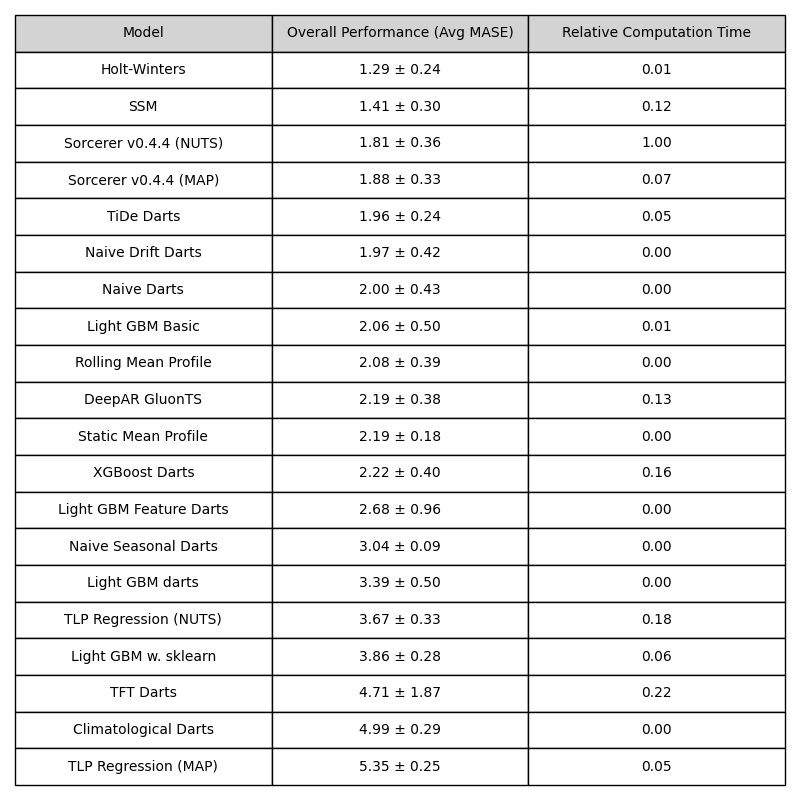

# Time Series Forecasting Review
This study is a collaborative effort in which a set of Python based time series forecast modules are 
reviewed. The forecast modules are reviewed *relatively out of the box*, meaning individual models from modules have not been given extensive feature engineering or attention. That said, fast and simple feature engineering has been tested on some models in order to gauge the effect. The scope has been to get familiar with a wide range of Python forecast modules and *loosely* gauge what their strengths and weaknesses are. The Authors recognize that the performance of models presented here
*could* change significanly by additional tweaking and feature engineering.

## Data
For this study, an aggregated version of the M5 dataset, a widely recognized dataset in the forecasting community, has been used. The M5 dataset contains daily sales data from Walmart's stores and departments across various geographical locations in the United States. The dataset is available from the [M5 Forecasting Competition on Kaggle](https://www.kaggle.com/competitions/m5-forecasting-accuracy/) and provides a comprehensive and challenging setting to test a broad range of forecasting algorithms due to its scale, granularity, and multiple hierarchies (e.g., store, department, and product categories). 

To include models which scale less well in the review, this study focuses on the weekly aggregated sales data for a particular store-category combination, specifically household sales. The time range of interest spans from 2011 to 2016 (see figure 1) with sales for each week.

_Figure 1: Weekly Sales for Each Store-Category. The training/test split has veried during the analysis (see the metric section) and is therefore not shown._

## Metric
In order to quantify and compare the accuracy of different forecasting algorithms, the Mean Absolute Scaled Error (MASE) is used

$$
\text{MASE} = \frac{\text{mean absolute forecasting error}}{\text{mean gradient in training data}}.
$$

The mean gradient in the training data represents the average forecasting error when using the Naive forecast (predict the next timestep to be equal to the current), so the MASE represents how good a model is relative to this.

This study will consider simultaneous forecasting of ten time series ($N_{\text{time series}} = 10$) over a forecast horizon of 26 weeks ($N_{\text{forecast horizon}} = 26$), and so a bit of notation must be introduced to handle this. In order to produce a robust estimate of the MASE, an ensemble of $N_{\text{ensemble}}=50$ forecasts are considered. The ensemble is produced by producing forecasts for each element in the interval

$$
[N-(N_{\text{ensemble}} + N_{\text{forecast horizon}}), N - N_{\text{forecast horizon}}]
$$

where $N$ is the number of data points in the time series (all have the same number of data points for simplicity). For each time step in the forecast horizon, there will therefore be $N_{\text{ensemble}}$ values from which to determine a MASE for each time series and forecast time step.

Let $f_{i,j,q}$ and $y_{i,j,q}$ denote the model forecast and data, respectively, for time step $i$, time series $j$, and ensemble number $q$, then

$$
\text{MASE}_{i,j} = \frac{
    \frac{1}{N_{\text{ensemble}}} \sum_{q=1}^{N_{\text{ensemble}}} |f_{i,j,q} - y_{i,j,q}|
    }{
        \frac{1}{N_{\text{training}}-1} \sum_{i=1}^{N_{\text{training}}} |y_{i-2,j} - y_{i,j}|
        }
$$
where
$$
N_{\text{training}} \equiv N - (N_{\text{ensemble}} + N_{\text{forecast horizon}}) - 1
$$

represents the part of the data that is common to all ensembles. To condense the information, the MASE can be averaged over time series

$$
\text{MASE}_i \equiv \frac{1}{N_{\text{time series}}} \sum_{j=1}^{N_{\text{time series}}} \text{MASE}_{i,j}
$$
where

$$
\text{MASE}_i \equiv \text{Average MASE over time series}
$$

and again over the forecast horizon

$$
\langle \text{MASE} \rangle \equiv \frac{1}{N_{\text{forecast horizon}} N_{\text{time series}}} \sum_{i=1}^{N_{\text{forecast horizon}}} \sum_{j=1}^{N_{\text{time series}}} \text{MASE}_{i,j}
$$
where for shorthand
$$
\langle \text{MASE} \rangle \equiv \text{Average MASE over time series and forecast horizon}.
$$

As a _rough_ estimate of uncertainty for this average MASE, the standard deviation of the average over time series is considered

$$
\delta \langle \text{MASE} \rangle = \sqrt{\frac{1}{N_{\text{forecast horizon}} - 1} \sum_{i=1}^{N_{\text{forecast horizon}}} (\text{MASE}_i - \langle \text{MASE} \rangle)^2}
$$

This assumes the variation between time series can be neglected relative to the variation between forecast horizon steps. The uncertainty is intended to be a conservative estimate of the variance in the sample, rather than the uncertainty of the mean estimate (if the latter is intended, the variance in equation $\langle \text{MASE}\rangle$ and error propagation can be used).

## Results

_Figure 1: Summary table._

_Figure 2: Average MASE Over Time Series._

